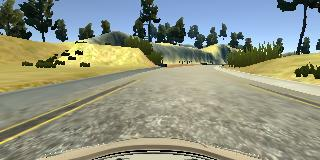
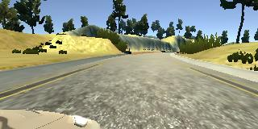

# **Behavioral Cloning Project**

The goals / steps of this project are the following:
* Use the simulator to collect data of good driving behavior
* Build, a convolution neural network in Keras that predicts steering angles from images
* Train and validate the model with a training and validation set
* Test that the model successfully drives around track one without leaving the road
* Summarize the results with a written report


[//]: # (Image References)

[model]: ./examples/model.png "Model Visualization"
[aug]: ./examples/augmentation.jpg "Augmentation"
[center]: ./examples/center.jpg "Center Lane"
[left]: ./examples/left.jpg "Left Lane"
[right]: ./examples/right.jpg "Right Lane"
[preview]: ./examples/output.gif "Preview"

![preview][preview]
## Rubric Points
Here I will consider the [rubric points](https://review.udacity.com/#!/rubrics/432/view) individually and describe how I addressed each point in my implementation.  

### Files Submitted & Code Quality

#### 1. Submission includes all required files and can be used to run the simulator in autonomous mode

My project includes the following files:
* model.py containing the script to create and train the model
* drive.py for driving the car in autonomous mode
* model.h5 containing a trained convolution neural network 
* writeup_report.md or writeup_report.pdf summarizing the results

#### 2. Submission includes functional code
Using the Udacity provided simulator and my drive.py file, the car can be driven autonomously around the track by executing 
```bash
python drive.py model.h5
```

#### 3. Submission code is usable and readable

The model.py file contains the code for training and saving the convolution neural network. The file shows the pipeline I used for training and validating the model, and it contains comments to explain how the code works.

### Model Architecture and Training Strategy

#### 1. An appropriate model architecture has been employed

My model is based on the [Nvidia net](https://images.nvidia.com/content/tegra/automotive/images/2016/solutions/pdf/end-to-end-dl-using-px.pdf)

Here is the graph of my model (Warning: it's a bit long):

![model][model]

Yes, it's similiar to the one in the paper. However, there are a few changes I made to make this work for this project. The differences from the paper are the follwoing:

* Cropping Layer was added as a first layer
    * Why? The model doesn't need information about sky or some objects that are unreachable (e.g. road across the river). Hence, I cropped to the region of interest. However, it's not shown in this model because it's outside of the graph.
* Lambda: Standardization(Normalization) layer
    * Each image input can have different brighness/contrast. So, I included a samplewise standardization layer to the model such that test images can also be standardized.
* 1x1 Convolution Layer
    * Why? ~RGB~(actually it's BGR) color space is good for human but it may not be the case for a machine. I left it as a free variable such that it can learn good color spaces for the model.
* BatchNormalization & Relu Layer
    * It was not mentioned in the paper, but I used the batchnorm before every activation layer(Relu). The batchnorm helped the model to converge faster.


####  2. Attempts to reduce overfitting in the model

* I used the Batchnormalization and I skipped the dropout layer because as the batchnorm paper suggested that the dropout layer did not really improve the performance. In fact, the batchnormalization layer works good as a regularizer alone.

* I also used scikit-learn to split training and validation data (Split Ratio 0.2) to ensure the model is not overfitting. I used a few tricks such as early stopping and model checkpoint. It means that my model will stop training if the validation loss stops decreasing and my model will save when the validation loss is at the minimum.

* I also use various image augmentations, which will be explained in the next section.

#### 3. Model parameter tuning

* The model used an adam optimizer, so the learning rate was not tuned manually (model.py line 25)
* I tried various hyper parameters such as different number of hidden nodes/layers, etc. I even tried pretrained networks. It worked okay but I didn't find it better than my final model.

#### 4. Appropriate training data

* Training data was collected by driving the vehicle in the simulator. It generated 3 images from the center, the left, and the right side.
* And sensor data was also collected such as steering angle, throttle, brake, and speed. However, only the steering angle was used in this example.

For details about how I created the training data, see the next section.

### Architecture and Training Documentation
 
#### 1. Solution Design Approach

The overall strategy for deriving a model architecture was to make a simple model based on other well known networks. I tried pretrained Vggnet and Inception V3 Network, but I ended up choosing the Nvidia network, and then I modified to a much smaller network to avoid overfitting because my data is much smaller than real driving data. One interesting about this network is not using any pooling layers. Instead, it uses strides of 2 to reduce the image sizes, which I found to be working really well.

In order to make sure the model is learning to drive, I split my datasets into a training and validation set, and I use a mean squared error for the metric.

The final step was to run the simulator to see how well the car was driving around track one. There were a few spots where the vehicle fell off the track. So, I had to improve the driving behavior by collecting more data. However instead of running more simulations, I used data augmentaions to expand my datasets.

At the end of the process, the vehicle is able to drive autonomously around the track without leaving the road.

#### 2. Final Model Architecture

It was mentioned above.

#### 3. Creation of the Training Set & Training Process

When I run driving on the track, three images are caputred from the left, center, and right.

<div align='center'>
  
</div>


Then, I used all these 3 images as following:

* When an input is the left image, I added a 0.25 to the steering angle. This will push the car to the center when the car sees something like this
* Likewise, for the right image, I subtracted the same value from the steering angle. So, the car will steer toward the center lane
* Finally, I use the true steering angle for the center images

This way it helped the model to learn how to recover to the center when the car steers to the sides. 

For the last step, I created a generator that create fake data randomly as inputs.

Through data augmentaions, it works as if I have unlimited number of data.
Beacuse I relied on the data augmenation, I augmented very strongly. 

Some of augmentations include:

* Affine: which means to transform/shear/roate/flip the image
* Dropout: some of image pixels are dropped out (zero filled)
* Invert
* Brightness, etc.

Here is the visualization of my image augmentations:
![aug][aug]

